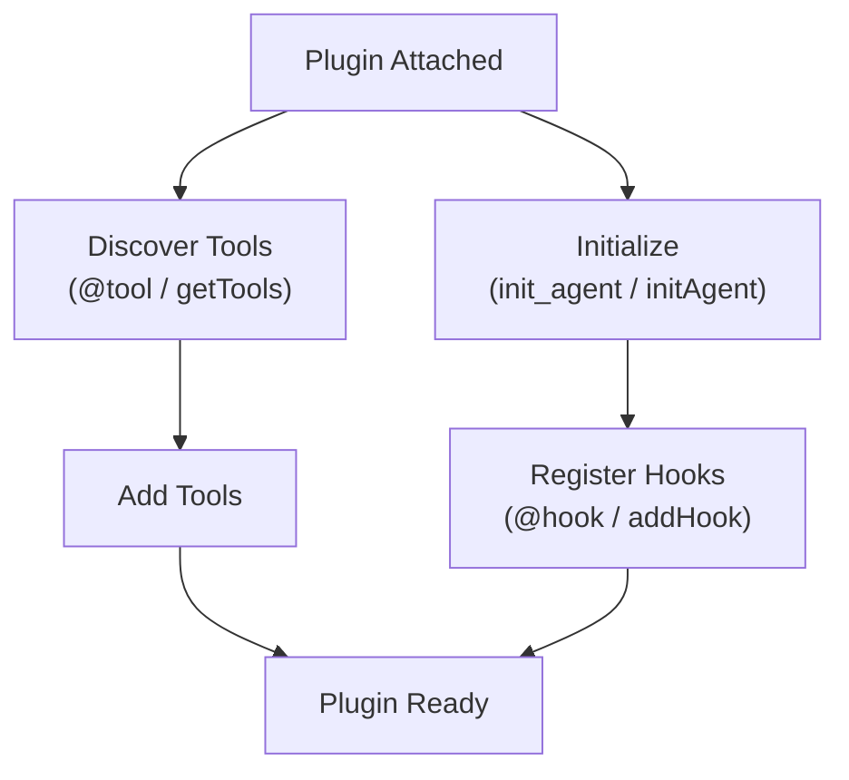

Plugins allow you to change the typical behavior of an agent. They enable you to introduce concepts like [Skills](https://agentskills.io/specification), [steering](/docs/user-guide/concepts/plugins/steering/index.md), or other behavioral modifications into the agentic loop. Plugins work by taking advantage of the low-level primitives exposed by the Agent class—`model`, `system_prompt`, `messages`, `tools`, and `hooks`—and executing logic to improve an agent’s behavior.

The Strands SDK provides built-in plugins that you can use out of the box:

-   **[Skills](/docs/user-guide/concepts/plugins/skills/index.md)** - On-demand, modular instructions that agents discover and activate at runtime following the [Agent Skills specification](https://agentskills.io/specification)
-   **[Steering](/docs/user-guide/concepts/plugins/steering/index.md)** - Modular prompting for complex agent tasks through context-aware guidance
-   **[Context Offloader](/docs/user-guide/concepts/plugins/context-offloader/index.md)** - Proactively offloads oversized tool results to storage, replacing them with previews and providing a built-in retrieval tool

You can also build and distribute your own plugins to extend agent functionality. See [Get Featured](/docs/community/get-featured/index.md) to share your plugins with the community.

## Using Plugins

Plugins are passed to agents during initialization via the `plugins` parameter:

(( tab "Python" ))
```python
from strands import Agent
from strands.vended_plugins.steering import LLMSteeringHandler

# Create an agent with plugins
agent = Agent(
    tools=[my_tool],
    plugins=[LLMSteeringHandler(system_prompt="Guide the agent...")]
)
```
(( /tab "Python" ))

(( tab "TypeScript" ))
```typescript
import { Agent, Plugin, Tool } from '@strands-agents/sdk'

// Create an agent with plugins
const agent = new Agent({
  tools: [myTool],
  plugins: [new GuidancePlugin('Guide the agent...')],
})
```
(( /tab "TypeScript" ))

## Building Plugins

This section walks through how to build a custom plugin step by step.

### Basic Plugin Structure

A plugin is a class that extends the `Plugin` base class and defines a `name` property. For example, a simple logging plugin would look like this:

(( tab "Python" ))
```python
from strands import Agent, tool
from strands.plugins import Plugin, hook
from strands.hooks import BeforeToolCallEvent, AfterToolCallEvent

class LoggingPlugin(Plugin):
    """A plugin that logs all tool calls and provides a utility tool."""

    name = "logging-plugin"

    @hook
    def log_before_tool(self, event: BeforeToolCallEvent) -> None:
        """Called before each tool execution."""
        print(f"[LOG] Calling tool: {event.tool_use['name']}")
        print(f"[LOG] Input: {event.tool_use['input']}")

    @hook
    def log_after_tool(self, event: AfterToolCallEvent) -> None:
        """Called after each tool execution."""
        print(f"[LOG] Tool completed: {event.tool_use['name']}")

    @tool
    def debug_print(self, message: str) -> str:
        """Print a debug message.

        Args:
            message: The message to print
        """
        print(f"[DEBUG] {message}")
        return f"Printed: {message}"

# Using the plugin
agent = Agent(plugins=[LoggingPlugin()])
agent("Calculate 2 + 2 and print the result")
```
(( /tab "Python" ))

(( tab "TypeScript" ))
```typescript
import { Agent, FunctionTool, Plugin, Tool } from '@strands-agents/sdk'
import { BeforeToolCallEvent, AfterToolCallEvent } from '@strands-agents/sdk'

class LoggingPlugin implements Plugin {
  name = 'logging-plugin'

  initAgent(agent: LocalAgent): void {
    // Register hooks manually in initAgent
    agent.addHook(BeforeToolCallEvent, (event) => {
      console.log(`[LOG] Calling tool: ${event.toolUse.name}`)
      console.log(`[LOG] Input: ${JSON.stringify(event.toolUse.input)}`)
    })

    agent.addHook(AfterToolCallEvent, (event) => {
      console.log(`[LOG] Tool completed: ${event.toolUse.name}`)
    })
  }

  getTools(): Tool[] {
    // Provide additional tools via the plugin
    return [debugPrintTool]
  }
}

// Using the plugin
const agent = new Agent({
  plugins: [new LoggingPlugin()],
})

// Custom tool to add
const debugPrintTool = new FunctionTool({
  name: 'debug_print',
  description: 'Print a debug message',
  inputSchema: {
    type: 'object',
    properties: {
      message: { type: 'string', description: 'The message to print' },
    },
    required: ['message'],
  },
  callback: async (input: unknown) => {
    const typedInput = input as { message: string }
    console.log(`[DEBUG] ${typedInput.message}`)
    return `Printed: ${typedInput.message}`
  },
})
```
(( /tab "TypeScript" ))

### How It Works Under the Hood

When you attach a plugin to an agent, the following happens:

(( tab "Python" ))
1.  **Discovery**: The `Plugin` base class scans for methods decorated with `@hook` and `@tool`
2.  **Hook Registration**: Each `@hook` method is registered with the agent’s hook registry based on its event type hint
3.  **Tool Registration**: Each `@tool` method is added to the agent’s tools list
4.  **Initialization**: The `init_agent(agent)` method is called for any custom setup
(( /tab "Python" ))

(( tab "TypeScript" ))
1.  **Tool Registration**: The `getTools()` method is called to get tools provided by the plugin
2.  **Initialization**: The `initAgent(agent)` method is called for hook registration and setup
3.  **Hook Registration**: In `initAgent`, use `agent.addHook()` to register event callbacks manually

**Note**: TypeScript does not use `@hook` or `@tool` decorators. Instead, tools are returned from `getTools()` and hooks are registered manually in `initAgent()`.
(( /tab "TypeScript" ))



### Registering Hooks in Plugins

(( tab "Python" ))
#### The `@hook` Decorator

The `@hook` decorator marks methods as hook callbacks. The event type is automatically inferred from the type hint:

```python
from strands.plugins import Plugin, hook
from strands.hooks import BeforeModelCallEvent, AfterModelCallEvent

class ModelMonitorPlugin(Plugin):
    name = "model-monitor"

    @hook
    def before_model(self, event: BeforeModelCallEvent) -> None:
        """Event type inferred from type hint."""
        print("Model call starting...")

    @hook
    def on_model_event(self, event: BeforeModelCallEvent | AfterModelCallEvent) -> None:
        """Handle multiple event types with a union."""
        print(f"Model event: {type(event).__name__}")
```
(( /tab "Python" ))

(( tab "TypeScript" ))
#### Manual Hook Registration

TypeScript plugins register hooks manually in the `initAgent` method using `agent.addHook()`:

```typescript
import { Plugin } from '@strands-agents/sdk'
import { BeforeModelCallEvent, AfterModelCallEvent } from '@strands-agents/sdk'

class ModelMonitorPlugin implements Plugin {
  name = 'model-monitor'

  initAgent(agent: LocalAgent): void {
    // Register a hook for a single event type
    agent.addHook(BeforeModelCallEvent, () => {
      console.log('Model call starting...')
    })

    // Register the same handler for multiple event types (union equivalent)
    const onModelEvent = (event: BeforeModelCallEvent | AfterModelCallEvent) => {
      console.log(`Model event: ${event.constructor.name}`)
    }
    agent.addHook(BeforeModelCallEvent, onModelEvent)
    agent.addHook(AfterModelCallEvent, onModelEvent)
  }
}
```
(( /tab "TypeScript" ))

### Manual Hook and Tool Registration

For more control, you can manually register hooks and tools in the `init_agent` method:

(( tab "Python" ))
```python
from strands.plugins import Plugin
from strands.hooks import BeforeToolCallEvent

class ManualPlugin(Plugin):
    name = "manual-plugin"

    def __init__(self, verbose: bool = False):
        super().__init__()
        self.verbose = verbose

    def init_agent(self, agent: "Agent") -> None:
        # Conditionally register additional hooks
        if self.verbose:
            agent.add_hook(self.verbose_log, BeforeToolCallEvent)

        # Access agent properties
        print(f"Attached to agent with {len(agent.tool_names)} tools")

    def verbose_log(self, event: BeforeToolCallEvent) -> None:
        print(f"[VERBOSE] {event.tool_use}")
```
(( /tab "Python" ))

(( tab "TypeScript" ))
```typescript
import { Plugin } from '@strands-agents/sdk'
import { BeforeToolCallEvent } from '@strands-agents/sdk'

class ManualPlugin implements Plugin {
  private verbose: boolean

  name = 'manual-plugin'

  constructor(options: { verbose?: boolean } = {}) {
    this.verbose = options.verbose ?? false
  }

  initAgent(agent: LocalAgent): void {
    // Conditionally register additional hooks
    if (this.verbose) {
      agent.addHook(BeforeToolCallEvent, (event) => {
        console.log(`[VERBOSE] ${JSON.stringify(event.toolUse)}`)
      })
    }

    // Access agent tools via toolRegistry
    console.log(`Attached to agent with ${agent.toolRegistry.list().length} tools`)
  }
}
```
(( /tab "TypeScript" ))

### Managing Plugin State

Plugins can maintain state that persists across agent invocations. For state that needs to be serialized or shared, use the [Agent State](/docs/user-guide/concepts/agents/state/index.md) mechanism:

(( tab "Python" ))
```python
from strands import Agent
from strands.plugins import Plugin, hook
from strands.hooks import BeforeToolCallEvent, AfterToolCallEvent

class MetricsPlugin(Plugin):
    """Track tool execution metrics using agent state."""

    name = "metrics-plugin"

    def init_agent(self, agent: "Agent") -> None:
        # Initialize state values if not present
        if "metrics_call_count" not in agent.state:
            agent.state.set("metrics_call_count", 0)

    @hook
    def count_calls(self, event: BeforeToolCallEvent) -> None:
        current = event.agent.state.get("metrics_call_count", 0)
        event.agent.state.set("metrics_call_count", current + 1)

# Usage
agent = Agent(plugins=[MetricsPlugin()])
agent("Do some work")
print(f"Tool calls: {agent.state.get('metrics_call_count')}")
```
(( /tab "Python" ))

(( tab "TypeScript" ))
```typescript
import { Agent, Plugin } from '@strands-agents/sdk'
import { BeforeToolCallEvent } from '@strands-agents/sdk'

class MetricsPlugin implements Plugin {
  name = 'metrics-plugin'

  initAgent(agent: LocalAgent): void {
    // Initialize state values if not present
    if (!agent.appState.get('metrics_call_count')) {
      agent.appState.set('metrics_call_count', 0)
    }

    agent.addHook(BeforeToolCallEvent, () => {
      const current = (agent.appState.get('metrics_call_count') as number) ?? 0
      agent.appState.set('metrics_call_count', current + 1)
    })
  }
}

// Usage
const metricsPlugin = new MetricsPlugin()
const agent = new Agent({
  plugins: [metricsPlugin],
})
console.log(`Tool calls: ${agent.appState.get('metrics_call_count')}`)
```
(( /tab "TypeScript" ))

See [Agent State](/docs/user-guide/concepts/agents/state/index.md) for more information on state management.

### Async Plugin Initialization

Plugins can perform asynchronous initialization:

(( tab "Python" ))
```python
import asyncio
from strands.plugins import Plugin, hook
from strands.hooks import BeforeToolCallEvent

class AsyncConfigPlugin(Plugin):
    name = "async-config"

    async def init_agent(self, agent: "Agent") -> None:
        # Async initialization
        self.config = await self.load_config()

    async def load_config(self) -> dict:
        await asyncio.sleep(0.1)  # Simulate async operation
        return {"setting": "value"}

    @hook
    def use_config(self, event: BeforeToolCallEvent) -> None:
        print(f"Config: {self.config}")
```
(( /tab "Python" ))

(( tab "TypeScript" ))
```typescript
import { Plugin } from '@strands-agents/sdk'
import { BeforeToolCallEvent } from '@strands-agents/sdk'

class AsyncConfigPlugin implements Plugin {
  private config: Record<string, unknown> = {}

  name = 'async-config'

  async initAgent(agent: LocalAgent): Promise<void> {
    // Async initialization
    this.config = await this.loadConfig()

    agent.addHook(BeforeToolCallEvent, () => {
      console.log(`Config: ${JSON.stringify(this.config)}`)
    })
  }

  private async loadConfig(): Promise<Record<string, unknown>> {
    await new Promise((resolve) => setTimeout(resolve, 100)) // Simulate async operation
    return { setting: 'value' }
  }
}
```
(( /tab "TypeScript" ))

## Next Steps

-   [Hooks](/docs/user-guide/concepts/agents/hooks/index.md) - Learn about the underlying hook system
-   [Steering](/docs/user-guide/concepts/plugins/steering/index.md) - Explore the built-in steering plugin
-   [Context Offloader](/docs/user-guide/concepts/plugins/context-offloader/index.md) - Manage large tool results proactively
-   [Get Featured](/docs/community/get-featured/index.md) - Share your plugins with the community

## Related pages

- [Agent Loop](/docs/user-guide/concepts/agents/agent-loop/index.md) (2 shared tags)
- [Hooks](/docs/user-guide/concepts/agents/hooks/index.md) (2 shared tags)
- [Interrupts](/docs/user-guide/concepts/interrupts/index.md) (2 shared tags)
- [Interventions](/docs/user-guide/concepts/agents/interventions/index.md) (2 shared tags)
- [Tool Executors](/docs/user-guide/concepts/tools/executors/index.md) (1 shared tag)
- [Bidirectional Streaming Hooks](/docs/user-guide/concepts/bidirectional-streaming/hooks/index.md) (1 shared tag)
- [Retry Strategies](/docs/user-guide/concepts/agents/retry-strategies/index.md) (1 shared tag)
- [Steering](/docs/user-guide/concepts/plugins/steering/index.md) (1 shared tag)
- [Context Offloader](/docs/user-guide/concepts/plugins/context-offloader/index.md) (1 shared tag)
